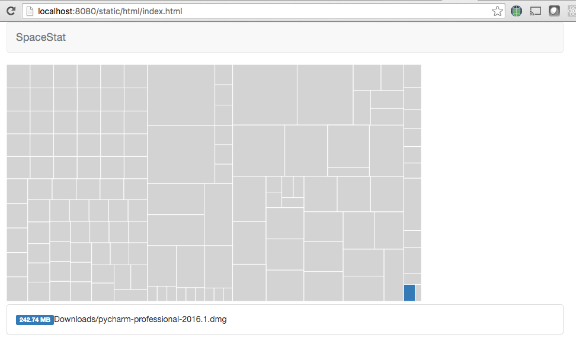

# spacestat
===========

The tool to graphically represents space occupied by directories and files on the file system.
This will be a web-based analog of SequaiaView

Version
-------
Currently the tool is under development. More documentation will appear.

Screenshots
-----------

References
----------
1. SequoiaView - http://sequoiaview.en.softonic.com/
2. Squarify - https://github.com/laserson/squarify
3. Squarified Treemaps algorithm - https://www.win.tue.nl/~vanwijk/stm.pdf
